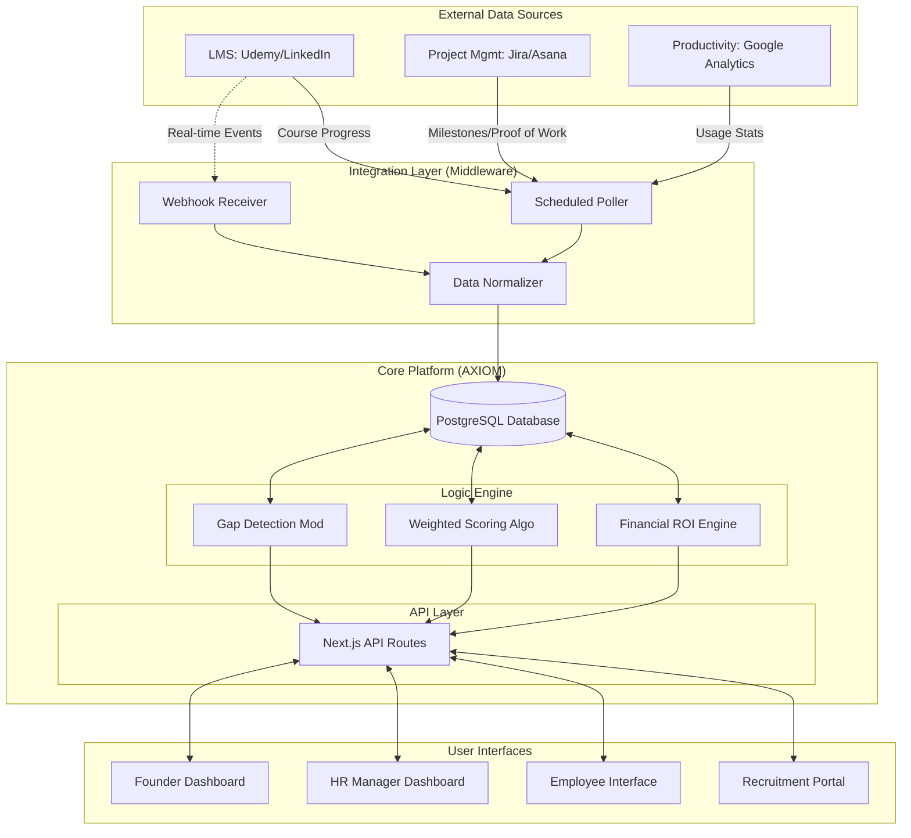

# AXIOM System Architecture

## Overview
AXIOM is a diverse Skill Intelligence Platform. This document outlines the high-level architecture facilitating the flow of data from external integrations to the core Logic Engine and finally to the User Interfaces.

## High-Level Architecture Diagram

## Component Details

### 1. Integration Layer
- **Purpose**: Ingest objective data from disparate sources.
- **Components**:
  - **Webhook Receiver**: Endpoint for real-time updates (e.g., Ticket Completed).
  - **Poller**: Cron jobs to fetch daily/weekly stats.
  - **Normalizer**: Converts vendor-specific JSON into a standardized "Activity Event" format.

### 2. Logic Engine
- **Weighted Scoring Algorithm**:
  - `Score = (Work_Output * 0.4) + (Manager_Obs * 0.3) + (Peer_Feedback * 0.2) + (System_Usage * 0.1)`
- **Gap Detection**: Analyzes User Skill Level vs. Role Requirement Level. Triggers IDP creation.

### 3. Database
- **PostgreSQL**: Relational integrity for Users, Skills, and transactional Activity Logs.

### 4. Frontend (Next.js)
- **Multi-Role Access**: Role-based routing (RBAC) to serve distinct UI layouts for Founders, HR, and Employees.

